# AyaskVedh — AI-Based Manganese Exploration & Production Planning Decision Support System
> **Smart India Hackathon (SIH 2026) | Problem Statement ID: 26009**  
> **Target Enterprise: MOIL Limited (Miniratna Schedule-A PSU under Ministry of Steel, Govt. of India)**

---

## Executive Summary

**AyaskVedh** is an industrial-grade Decision Support System (DSS) designed to address the dual challenges faced in Indian manganese mining operations:
1. **Greenfield & Brownfield Mineral Exploration:** High-resolution spatial predictive modeling across a 1 km² mineral grid over the Madhya Pradesh and Maharashtra manganese belts, integrating satellite multispectral data, topography, geology, soil geochemistry, and geophysics.
2. **Production Target Attainment & Shortfall Mitigation:** Real-time machine learning prediction of monthly mine production tonnages, early warning of production shortfalls, local SHAP explainability, and prescriptive operational recommendations across 10 flagship MOIL underground and opencast mines.

The system is deployed as a decoupled full-stack architecture featuring a **Python FastAPI** backend powered by locked **XGBoost** ML pipelines and a **React 19 + TypeScript + Vite + Tailwind CSS** frontend delivering interactive spatial maps, drill-down diagnostics, what-if simulators, and industrial executive dashboards.

---

## System Architecture

```mermaid
graph TD
    subgraph Client ["Frontend (React 19 + TypeScript + Vite)"]
        UI_Home[Executive Overview Dashboard]
        UI_Explore[Exploration GIS Map & Coordinate Inspector]
        UI_Prod[Production Planning & Diagnostic Console]
        UI_WhatIf[What-If Sensitivity Simulation Sandbox]
        UI_Perf[Model Performance & Benchmark Reports]
        Map_Leaflet[Leaflet GIS Engine + ArcGIS Imagery]
    end

    subgraph Gateway ["Vite Reverse Proxy (:5173 -> :8000)"]
        Proxy["/api/* Reverse Proxy"]
    end

    subgraph Backend ["Backend API Service (FastAPI + Uvicorn)"]
        Routes["backend/routes.py (REST API Router)"]
        Service["backend/models_service.py (ModelService Singleton)"]
        SpatialTree["cKDTree (80,000 1km² Exploration Cells)"]
        ExplainEngine["TreeSHAP Attribution Engine"]
        PrescriptiveEngine["Prescriptive Heuristics Engine"]
    end

    subgraph Models ["Machine Learning Engines (mlModel/)"]
        M1["prospectivity_classifier.joblib (XGBoost Classifier - 47 Features)"]
        M2["production_regressor.joblib (XGBoost Regressor - 36 Features)"]
        M3["shortfall_classifier.joblib (XGBoost Classifier - 36 Features)"]
    end

    Client --> Gateway
    Gateway --> Routes
    Routes --> Service
    Service --> SpatialTree
    Service --> ExplainEngine
    Service --> PrescriptiveEngine
    Service --> M1
    Service --> M2
    Service --> M3
```



---

## Repository Directory Structure

```plaintext
SIH12Sept/
├── backend/
│   ├── main.py                  # FastAPI application entrypoint, CORS & lifespan hooks
│   ├── routes.py                # REST API routes for exploration, production, what-if, metrics
│   └── models_service.py        # Core inference engine, KDTree spatial indexing, SHAP, recommendations
├── frontend/
│   ├── index.html               # Web application shell and Google Fonts (IBM Plex Sans, Outfit)
│   ├── package.json             # NPM package manifest (React 19, Leaflet, Recharts, GSAP, etc.)
│   ├── vite.config.ts           # Vite bundler configuration & /api reverse proxy to port 8000
│   └── src/
│       ├── App.tsx              # Application root, path-based routing, global layout
│       ├── api/
│       │   ├── client.ts        # Typed fetch wrapper with error handling
│       │   ├── exploration.ts   # Client calls for coordinate inspection & prospectivity
│       │   └── production.ts    # Client calls for production prediction, what-if, performance
│       ├── components/
│       │   ├── exploration/     # CoordinateInputPanel, DataEnrichmentProgress, ExplorationResultDrawer
│       │   ├── production/      # MineSelector, ProductionConditionForm, ProductionResultCard
│       │   ├── map/             # IndiaMap.tsx (Leaflet GIS with multi-basemap layers & MOIL mines)
│       │   └── layout/          # Header.tsx, Footer.tsx
│       └── pages/
│           ├── Home.tsx             # Executive dashboard & MOIL mine portfolio status
│           ├── Explore.tsx          # Exploration GIS workspace with map clicking & coordinate lookup
│           ├── Production.tsx       # Operational forecasting, risk gauges & prescriptive cards
│           ├── WhatIf.tsx           # Baseline vs scenario dual-panel parameter perturbation simulator
│           ├── Methodology.tsx      # Comprehensive data science & workflow documentation
│           ├── ModelPerformance.tsx # ROC curves, confusion matrices, MAE/RMSE, feature importance
│           └── landing/             # High-impact marketing landing page with GSAP animations
├── mlModel/
│   ├── data/
│   │   ├── raw/                 # 11-year MOIL historical production CSV, 1km MP/MH prospectivity grid
│   │   └── processed/           # Cached prospectivity predictions (26MB), train/test splits
│   ├── models/
│   │   ├── model_metadata.json          # Production model training specs, feature schema, metrics
│   │   ├── prospectivity_classifier.joblib # 47-feature exploration pipeline
│   │   ├── production_regressor.joblib     # 36-feature production forecasting regressor
│   │   └── shortfall_classifier.joblib     # 36-feature shortfall risk classifier
│   ├── notebooks/               # Jupyter training & EDA notebooks
│   │   ├── model_1_manganese_prospectivity.ipynb
│   │   └── model_2_production_shortfall.ipynb
│   ├── reports/                 # Evaluation metrics JSONs & diagnostic plots
│   └── src/                     # Standalone Python training, evaluation & SHAP scripts
└── README.md                    # System documentation
```

---

## Machine Learning Architecture

### Model 1: Manganese Exploration Prospectivity Classifier
- **Objective:** Classify 1 km² geographic cells across Madhya Pradesh & Maharashtra into prospectivity potential (`VERY HIGH`, `HIGH`, `MEDIUM`, `LOW`).
- **Algorithm:** `XGBClassifier` integrated with a scikit-learn preprocessing `ColumnTransformer` (StandardScaler for numerics, OneHotEncoder for categoricals).
- **Full Exploration Dataset:** **622,584 total spatial grid cells (~6.22 Lakh rows)** covering Madhya Pradesh & Maharashtra at 1 km² resolution (`manganese_prospectivity_MP_MH_1km.csv`).
  - **Unsurveyed Exploration Targets (`label = -1` / `PREDICT`):** 435,809 cells (~4.36 Lakhs) — unknown regions evaluated by the model for new deposit discoveries.
  - **Ground-Truth Surveyed Cells (`label = 0` or `1`):** 186,775 cells (~1.87 Lakhs).
  - **Model Training Split (`TRAIN`):** 125,891 cells (~1.26 Lakhs) used to train the XGBoost pipeline.
  - **Model Evaluation Split (`TEST`):** 30,929 cells (~31K) used for independent blind testing (which achieved 87.27% accuracy / 0.951 ROC-AUC).
  - **Model Validation Split (`VALIDATION`):** 29,955 cells (~30K).
- **Features (47 dimensions across 6 domains):**
  1. *Multispectral Satellite (Sentinel-2):* Spectral bands B2-B12, NDVI, NDMI, NDWI, NDBI, SWIR band ratio, Iron Oxide Index, Clay Index, Ferrous Mineral Index.
  2. *Topography & Digital Elevation (DEM):* Elevation (m), Slope (°), Aspect, Profile Curvature, Plan Curvature, Topographic Position Index (TPI), Terrain Ruggedness (TRI), Drainage Density.
  3. *Geology & Structure:* Lithology, Host Rock, Geomorphology, Lineament Density, Fault/Intersection Density.
  4. *Pedology & Soil:* Soil pH, Clay %, Sand %, Silt %, Bulk Density, Cation Exchange Capacity (CEC), Soil Organic Carbon (SOC).
  5. *Geophysics & Climate:* Apparent Resistivity, Bouguer Gravity Anomaly, Annual Precipitation, Mean Temperature, Land Surface Temperature (LST), Soil Moisture.
  6. *Spatial Coordinates:* Latitude, Longitude, State.
- **Benchmark Performance:**
  - **ROC-AUC:** `0.9510`
  - **Accuracy:** `87.27%`
  - **Recall:** `88.34%`
  - **Precision:** `77.24%`
  - **F1-Score:** `82.42%`

### Model 2: Mine Production Regressor & Shortfall Classifier
- **Objective:** Predict monthly actual production tonnage ($t$) and quantify the probability of failing to meet production targets ($P(\text{Shortfall})$) for individual MOIL mines.
- **Algorithm:** Dual `XGBRegressor` + `XGBClassifier` pipelines.
- **Dataset:** 11 years (1,320 monthly production records) across 10 MOIL mines (Balaghat, Ukwa, Kandri, Tirodi, Beldongri, Munsar, Gumgaon, Chikla, Sitapatore, Dongri Buzurg).
- **Features (36 operational inputs):**
  - Planned production target, mine depth, active working faces, ore grade (Mn %), available ore tonnage.
  - Fleet metrics: available equipment count, operating count, equipment utilization ratio, breakdown count, equipment downtime hours, maintenance hours.
  - Blasting metrics: planned blasts, completed blasts, blast completion rate, blast delay hours, blast delay ratio.
  - Environmental & delays: rainfall (mm), ambient temperature, soil moisture, ventilation delay hours, clearance delays, grid power outage hours, transport delay hours.
  - Human resources & time-series momentum: available manpower, 1-month lagged production (`production_lag_1`), 7-month rolling average (`production_rolling_7`), month of year, day of year.
- **Leakage Prevention:** Removed all post-facto metrics (`actual_production_tonnes`, `production_variance_tonnes`, `production_achievement_pct`, `target_achieved`, `shortfall_tonnes`, `shortfall_pct`) during feature preparation.
- **Benchmark Performance:**
  - **Regressor $R^2$:** `0.9823` (MAE: 386.4 t, RMSE: 751.5 t)
  - **Classifier ROC-AUC:** `0.9237` (Accuracy: `87.12%`, Precision: `85.57%`, Recall: `80.58%`)

---

## Backend API Specification

All backend endpoints are prefixed with `/api` and served by FastAPI at `http://127.0.0.1:8000`:

| Method | Endpoint | Description |
| :--- | :--- | :--- |
| `GET` | `/api/health` | System health check, loaded model statuses, dataset record counts |
| `GET` | `/api/mines` | Real operational metadata, default baselines, and historical stats for all 10 MOIL mines |
| `GET` | `/api/exploration/points` | Pre-cached high-potential exploration cells for map rendering |
| `POST` | `/api/exploration/features` | Spatial enrichment: maps any lat/lon to nearest surveyed cell with 47 features |
| `POST` | `/api/exploration/predict` | Executes prospectivity pipeline, returns probability, level, and top SHAP factors |
| `POST` | `/api/exploration/explain` | Computes on-the-fly local SHAP attributions for a given coordinate |
| `POST` | `/api/production/predict` | Predicts expected production tonnage, shortfall probability, and risk categorization |
| `POST` | `/api/production/explain` | TreeSHAP attribution extracting specific positive/negative production drivers in tonnes |
| `POST` | `/api/production/recommendations`| Synthesizes prioritized operational interventions based on negative drivers |
| `POST` | `/api/production/what-if` | Computes comparative deltas between baseline and perturbed operational parameters |
| `GET` | `/api/model-performance` | Returns locked training metrics, test periods, and evaluation matrices |

---

## Frontend Workspaces

1. **Executive Portfolio (`/` & `/app`):** Overview of all 10 MOIL mines, aggregate monthly targets, operational health badges, and quick links to analytical modules.
2. **Exploration GIS Workspace (`/explore`):** Interactive Leaflet map featuring satellite/topographic/street layers, 2,000 prospectivity target cells, clickable map queries, coordinate manual inputs, and an animated **Exploration Result Drawer** displaying radial scores and SHAP radar breakdowns.
3. **Production Planning Console (`/production`):** Mine selector with pre-populated operational defaults, comprehensive condition form (fleet, blasting, delays, weather), real-time risk gauges, tonnage shortfall estimates, and prescriptive action recommendations.
4. **What-If Simulation Sandbox (`/what-if`):** Side-by-side comparison where planners can perturb variables (e.g. reduce equipment downtime by 5 hours, increase blasting completion rate) and instantly visualize the tonnage delta, shortfall risk migration, and financial impact.
5. **Model Performance & Transparency (`/model-performance`):** Complete audit trail showing validation curves, confusion matrices, feature importance rankings, and data domain breakdowns.
6. **Methodology Documentation (`/methodology`):** Detailed explanation of the mathematical formulation, data pipelines, and mining engineering principles.

---

## Installation & Running Locally

### Prerequisites
- Python 3.10+ (Python 3.11+ recommended)
- Node.js 18+ & npm 9+

### 1. Backend Setup
```bash
# From workspace root:
source .venv/bin/activate

# Start the FastAPI server on port 8000
python -m uvicorn backend.main:app --host 127.0.0.1 --port 8000 --reload
```
API Documentation will be live at: [http://127.0.0.1:8000/docs](http://127.0.0.1:8000/docs)

### 2. Frontend Setup
```bash
# In another terminal:
cd frontend
npm install
npm run dev
```
The React web application will be accessible at: [http://127.0.0.1:5173](http://127.0.0.1:5173)

---

## Licensing & Credits
- Built for the **Smart India Hackathon 2026** (Problem Statement 26009).
- Geological & operational parameters modeled after **MOIL Limited** published operational data and GSI (Geological Survey of India) mineral exploration bulletins.
